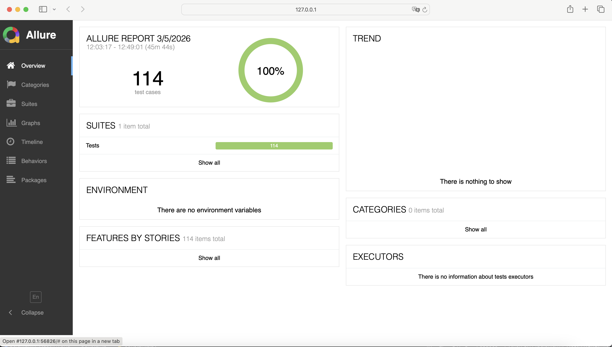

# Selenium Pytest Hybrid Automation Framework


A scalable UI + API automation framework built using Python, Selenium, Pytest, and Requests following the Page Object Model (POM) design pattern with data-driven testing and Allure reporting.

## Table of Contents

- Tech Stack
- Framework Highlights
- Project Structure
- Test Reporting (Allure)
- Running Tests
- Example Test Scenarios

##  ⚙️ Tech Stack

### Core Tools:
- Python 3.11
- Selenium WebDriver
- Pytest

### Framework Design:
- Page Object Model (POM)
- Data Driven Testing (Excel)

### Reporting:
- Allure Reporting

### Test Execution:
- Cross Browser Testing (Chrome, Firefox, Edge)

##  🚀 Framework Highlights
	•	Page Object Model (POM) architecture
	•	Data-driven testing using Excel
	•	Cross-browser execution (Chrome, Firefox, Edge)
	•	Allure reporting with test analytics
	•	Screenshot capture during test execution
	•	Clean project structure
	•	Pytest fixtures and parametrization

## 🔗 API Testing

    • Implemented API automation using Python requests and Pytest  
    • Covered CRUD operations: GET, POST, PUT, DELETE  
    • Validated status codes, response structure, and data integrity  
    • Implemented positive and negative API test scenarios  
    • Built reusable API client layer for scalable test design  

## Framework Architecture
```
Tests (Pytest)
│
▼
Page Objects (POM)
│
▼
Utilities / Helpers
│
├── Excel Reader
├── Config Reader
├── File Utils
└── API Client
│
▼
Selenium WebDriver
│
▼
Browser (Chrome / Firefox / Edge)
```

## 📂 Project Structure

```
Selenium_Hybrid_Framework_Pytest
│
├── Pages               # Page Object classes
├── Tests               # Test cases (UI + API)
├── Utilities           # Helpers (Excel reader, config reader, file utils, API client)
├── Constants           # UI text / default values
├── Config              # Configuration files
├── TestData            # Excel test data
├── TestFiles           # Files used for upload testing
├── Reports             # Screenshots / Allure results
├── assets              # Images used in README
├── Tests/conftest.py   # Pytest fixtures
├── requirements.txt    # Python dependencies
├── .gitignore          # Ignored files for Git
└── README.md
```

## 📊 Test Reporting (Allure)



The framework generates interactive test reports using Allure.

Features include:

	•	Test execution summary
	•	Pass / Fail statistics
	•	Test timeline
	•	Suite breakdown
	•	Failure analysis

## 🔧 Installation

Clone the repository
```bash
git clone https://github.com/swatijanapana/Selenium_Hybrid_Framework_Pytest.git
cd Selenium_Hybrid_Framework_Pytest
```
Create and activate virtual environment
```bash
python -m venv venv
source venv/bin/activate
```
Install dependencies
```bash
pip install -r requirements.txt
```

## ▶️ Running Tests

Run all tests
```bash
pytest
```

Run parallel execution
```bash
pytest -n auto
```

Run tests with Allure results
```bash
pytest --alluredir=Reports/allure-results
```

Open the Allure report
```bash
allure serve Reports/allure-results
```

##  🧪 Example Test Scenarios

	•	Login with valid credentials
	•	Login with invalid credentials
	•	Login with blank username/password
	•	Admin search functionality
	•	Reset filters verification
	•	Dropdown selection validation

 

## 👩‍💻 Author

Swati J – QA Analyst | Test Automation Engineer

• 6+ years of experience in banking and financial services.
• Designed and developed a Selenium Pytest automation framework. 
• Implemented POM architecture, data-driven testing (Excel), and Allure reporting. 
• Experienced in API validation, database testing, and cross-browser execution.

⭐ If you find this project useful, consider starring the repository or connecting with me on LinkedIn.